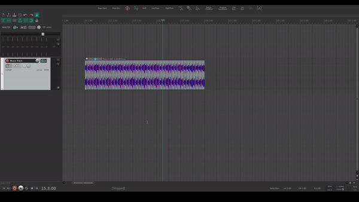

# ReaScript
A few script I made for Reaper, in LUA or Python.

## RS_AddMarkerToBeatsNormalizeLUFS.lua

Add a marker with the name of musical time on selected file. The tempo map has to be defined before running the script. 

## RS_CopyItemsWithMarkers.lua

Copy the selected item with its markers. 

## RS_CreateRegionsColoredAndLengthsItems.lua

Create a region of the length of the item selection, with the color of the top item. 
